# RES-Labo-HTTPInfra

**Author:** Rhyan Robertson
**Info :** All of these steps were done using a Linux OS, but you can adapt them easily for Windows or Mac.</br>It's recommended to follow the steps in a the correct sequence.

**Prerequisite :** You need a running Docker Engine, if it's not your case, you can follow this [guide](https://docs.docker.com/engine/install/ubuntu/).

## Step 1 : Static HTTP server with apache httpd

This step is about setting up a *Docker* HTTP server with apache [httpd](https://hub.docker.com/_/httpd) that serves static web content. 
For demo purposes, we'll use a simple Bootstrap theme ["Grayscale"](https://startbootstrap.com/theme/grayscale) as an example.

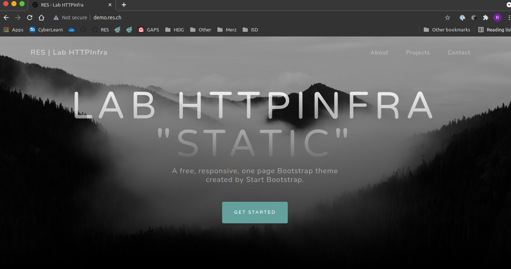

###### Dockerfile

```dockerfile
FROM httpd:2.4		# Specify version of httpd
```

###### build-container.sh

```sh
docker build -t res/step1	# Build image from the Dockerfile and name it

sudo chmod -R 775 www/		# Give users *read* rights to the `www` folder that contains
							# the static web content. 
```

###### run-container.sh

```sh
# run : Run a new conatiner
# -d : Detach the Container (run in background)
# -p : Publish Container Ports - host_port:container_port
# --name : Name container
# -v : Mount volume - host:container (Shared storage)
# 	   Current working dir is mounted in container file system.
# -res/step1 : chose image to run
docker run -d -p 8081:80 --name res-step1 -v "$PWD"/www/:/usr/local/apache2/htdocs/ res/step1
```

###### www/

Contains the static web content and is mount to the container's file system.

### Instructions

1. Go into folder *Step 1* : `Step1`.

2. Run : `build-container.sh`.  You might have to enter your password to grant the *read* rights to the `www` folder.

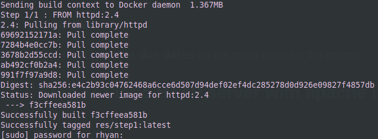

3. You can now run : `run-container.sh` with the default settings (port : 8081, mapped volume : /www) or you can edit them directly in `run-container.sh`.

You should now have a running Docker HTTP server. Check http://localhost:8081/ to see if it's working correctly.

### Configuration

The apache config files are located in `/usr/local/apache2/conf/`.

You can access the dir by execution a bash on the container. 
Run `docker exec -it res-step1 /bin/bash` then `cd /usr/local/apache2/conf/`.


## Step 2 : Dynamic HTTP server with express.js

This step is about setting up a Docker Dynamic HTTP server with [express.js](https://expressjs.com/) that generates dynamic, random content and returns a JSON payload to the client.

You can leave the container from [Step1](#Step-1-:-Static-HTTP-server-with-apache-httpd) running.
This app has 2 functions, generating a random JSON list of animals and displaying a custom message with a parameter in the URI

You can get a custom welcome message by changing the name at the end of the URI : http://localhost:8082/name/rhyan

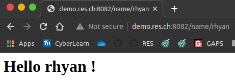

And you can get the list of Animals at http://localhost:8082 .

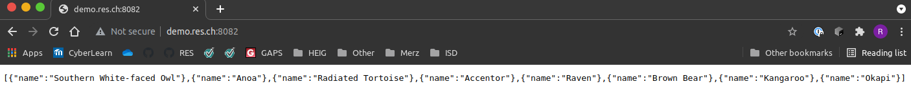


###### Dockerfile

```dockerfile
FROM node:latest	# Pull latest node image

# The WORKDIR instruction sets the working directory for any RUN, CMD, ENTRYPOINT, COPY
# and ADD instructions that follow it in the Dockerfile
WORKDIR /opt/app

COPY src ./		# Copy node app (index.js) and package.json (app info and dependencies)

RUN npm install	# This command installs a package and any packages that it depends on.

CMD ["node", "index.js"] # Start app
```


### Instructions
1. Go into folder `Step2`
2. Run `build-container.sh`

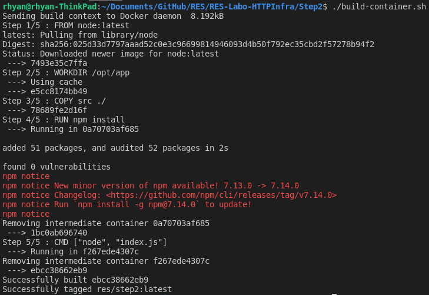

3. Run `run-container.sh`

You should now be able to access http://localhost:8082/ .

### Configuration

- You can changed the mapped port in run-container.sh
- You can change the internal port of the container in /src/index.js

## Step 3 : Reverse proxy with apache (static configuration)

In this step, we setup a reverse proxy (RP) with Docker apache server. 
The RP while chose which container to forward requests to based on the URL.

- demo.res.ch -> static
- demo.res.ch/api/animals/ -> dynamic

For the moment, the RP is "fragile" because it used IP address hard coded in `001-reverse-proxy.conf` . If you don't have the same IP's as the diag below, you can change them in above file.

The RP provides a **single point of entry** by setting the `Servername` to `demo.res.ch`.
The default VirtualHost in `000-default.conf` is empty so that if a request doesn't match the **static** or **dynamic** URL, it doesn't return anything.

***Note :*** An acceptance criteria is : "You can explain and prove that the static and dynamic servers cannot be reached directly (reverse proxy is a single entry point in the infra)".
But with a Linux OS, you can reach each server through it's IP address (for example: telnet 172.17.0.2 80, works). However this is only true for the host because of docker's bridge network. Other devices on the network won't be able to.

 

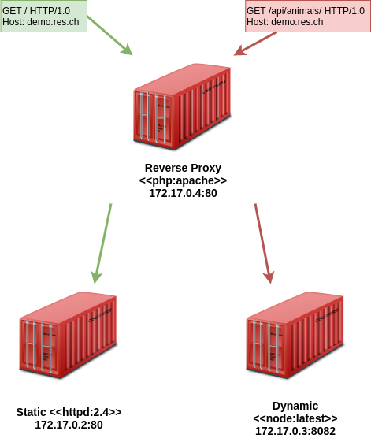

http://demo.res.ch/

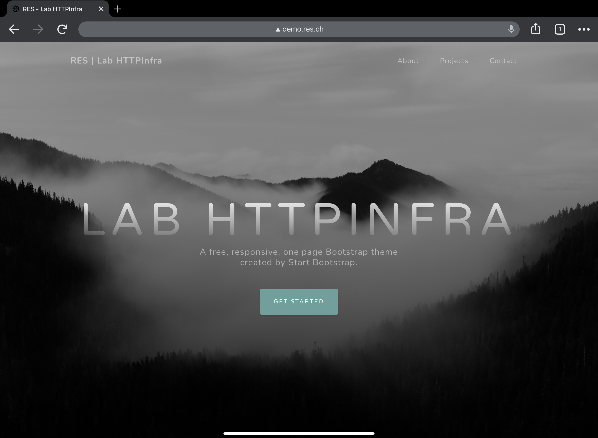

http://demo.res.ch/api/animals/
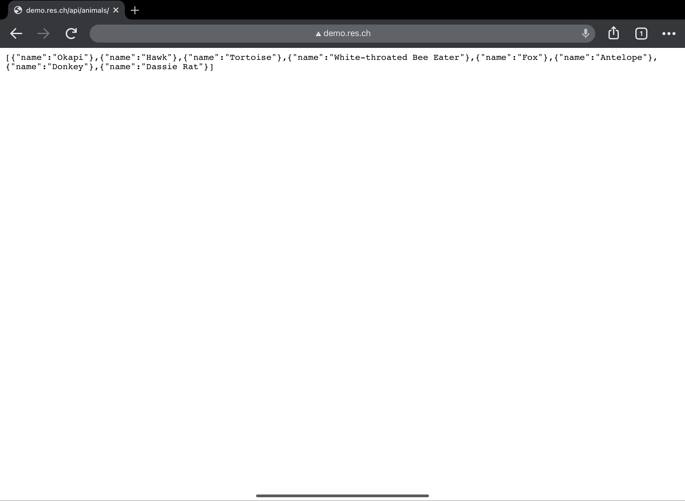

http://demo.res.ch/api/animals/name/rhyan

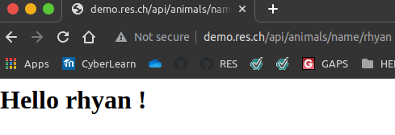

http://localhost/ or http://192.168.178.141 (my host IP)
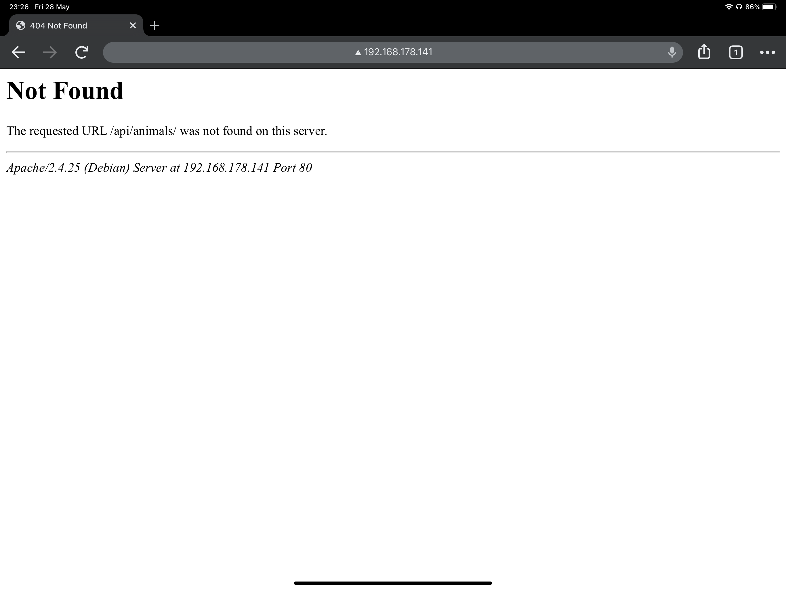

###### Dockerfile

```dockerfile
FROM php:5.6-apache		# Pull php image

# Copy 000-defalut.conf and 001-reverse-proxy.conf to apache server
COPY conf/ /etc/apache2	

# A script that enables proxy modules
RUN a2enmod proxy proxy_http 

# A script that enables the specified site (which contains a <VirtualHost> block) within
# the apache2  configuration
RUN a2ensite 000-* 001-*	 
```

###### run-container.sh

```sh
# Run in this order to try an preserve the IP addresses of the containers
# 172.17.0.2 -> 172.17.0.4
docker run -d --name res-step3-static -v "$PWD"/../Step1/www/:/usr/local/apache2/htdocs/ res/step1
docker run -d --name res-step3-dynamic res/step2
docker run -d -p 80:80 --name res-step3-rp res/step3-rp
```


### Instructions

1. Stop all running containers from previous steps `docker kill {name_of_container}`. 

   ```sh
   docker kill res-step1
   docker kill res-step2
   ```
   
2. Run `build-conatiner.sh`

3. Run `run-container.sh`


## Step 4 : AJAX requests with JQuery

This step simply add AJAX requests to the static site from Step 1 thanks to JQuery.

We use a simple JavaScript script (`www/js/animals.js`) that requests the JSON list of animals from /api/animals/ and modifies a DOM element to display the first animal of the list. It loops every 2000 [ms], so a new animal is displayed.

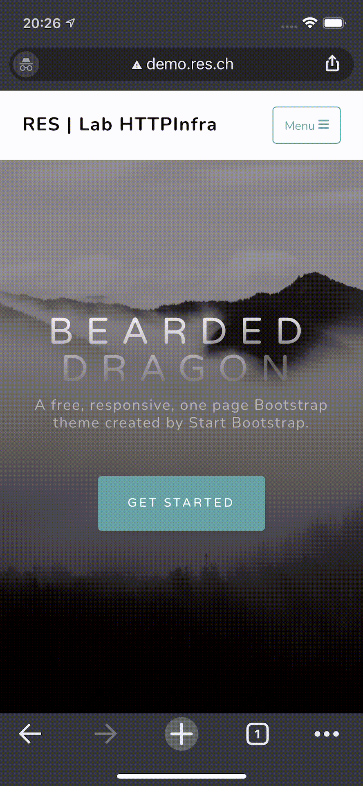

###### Content of responses

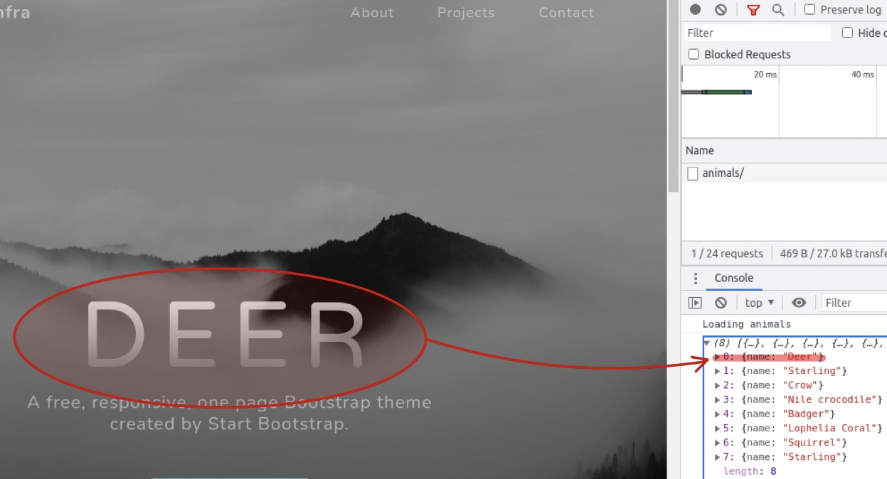

###### Same-Origin policy

*"The policy permits scripts running on pages originating from the same site to access each other's data with no specific restrictions, but prevents scripts access to data that is stored on a different domain.."*

Since the static and the dynamic servers aren't the same, the RP is necessary to have a common Hostname.


### Instructions

1. Go to Step 4 folder
2. Kill static server from previous step : `rest-step3-static` 
3. Run `run-container.sh`
4. Refresh http://demo.res.ch


## Step 5 : Dynamic reverse proxy configuration

This step fixes the issue with Step 3's hard coded IPs. You can now run the RP and pass the static and dynamic IP addresses as arguments . They will be stored as environment variables on the RP.

The `apache2-foreground` file is modded  to echo these variables and run the PHP script.

```sh
# Add setup for RES lab
echo "Setup for the RES lab..."
echo "Static app URL: $STATIC_APP"
echo "Dynamic app URL: $DYNAMIC_APP"

# Run script and store result in "001-reverse-proxy.conf"
php /var/apache2/templates/config-template.php > /etc/apache2/sites-available/001-reverse-proxy.conf

```

The PHP script creates a new `001-reverse-proxy.conf` file with the IPs passed at run. 

```php
<?php
$dynamic_app = getenv('DYNAMIC_APP');
$static_app = getenv('STATIC_APP');
?>

<VirtualHost *:80>
	ServerName res.labo.ch
	ProxyPass '/api/animals/' 'http://<?php echo "$dynamic_app"?>/'
	ProxyPassReverse '/api/animals/' 'http://<?php echo "$dynamic_app"?>/'

	ProxyPass '/' 'http://<?php echo "$static_app"?>/'
	ProxyPassReverse '/' 'http://<?php echo "$static_app"?>'
</VirtualHost>
```

```dockerfile
FROM php:7.2-apache

RUN apt-get update && \
  apt-get install -y nano

COPY apache2-foreground /usr/local/bin/ # Copy modified apache2-foreground
COPY templates /var/apache2/templates	# Copy template  001-reverse-proxy.conf
COPY conf/ /etc/apache2

RUN a2enmod proxy proxy_http
RUN a2ensite 000-* 001-*
```


### Instructions

1. Go to Step 5 folder
2. Kill the RP from previous step : `rest-step3-rp`
3. Build the dynamic RP by running : `build-container.sh`
4. Add static and dynamic server IPs to `run-conatiner.sh` and run it.

